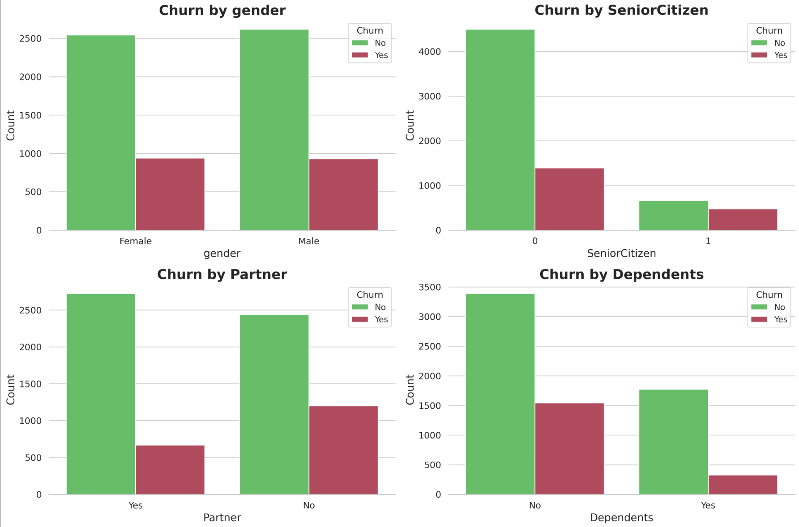
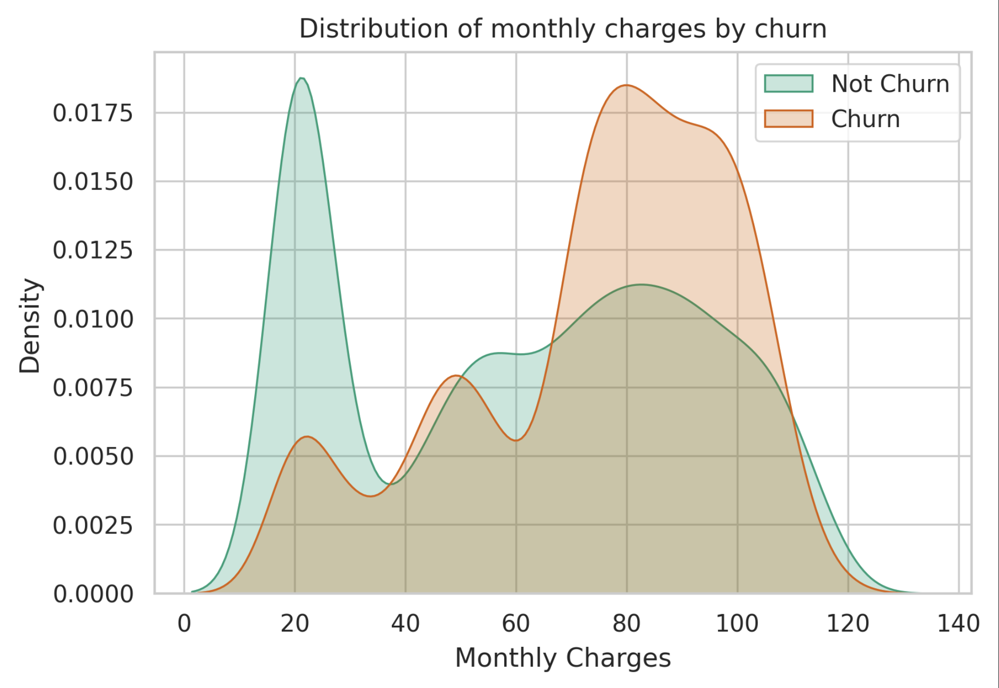
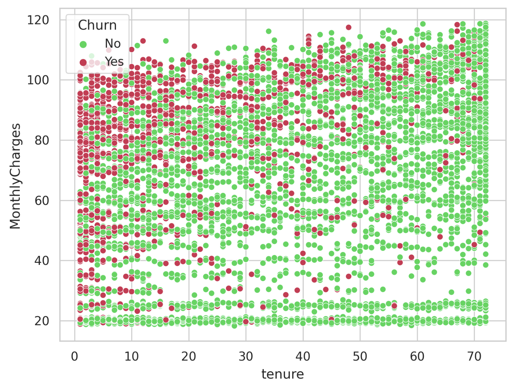
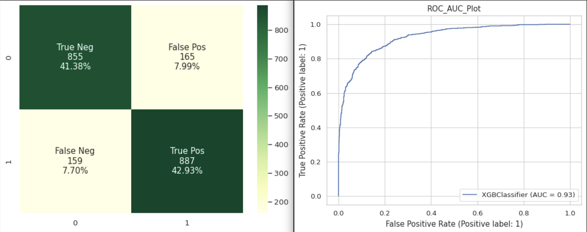

# Churn Prediction

Customer churn is a common problem for subscription-based businesses, including telecommunications companies. Predicting which customers are likely to leave can help businesses take steps to improve retention and reduce revenue loss.

This project focuses on analyzing a dataset of customer information to achieve two main objectives:
	•	Predicting Churn: Build machine learning models (e.g., Logistic Regression, Random Forest, XGBoost) to identify customers at risk of churning.
	•	Understanding Key Drivers: Examine the relationships between customer attributes and churn to identify the factors that most influence customer behavior.

The project will use these findings to provide recommendations for reducing churn and improving customer retention strategies.

## Executive Summary

### Overview of Findings
Churn is highest among **senior citizens** (proportionally), **single customers without dependents** (~35%), and customers on **month-to-month contracts.** Bundled services, particularly entertainment options, and automatic payment methods **significantly reduce churn,** while fiber optic internet users show elevated churn rates requiring investigation. Customers paying via electronic check have the highest churn, and churn is most likely within the first year of tenure, especially for customers in the $70+ monthly charge range. Addressing these specific segments and optimizing service offerings and payment options can directly improve retention.

## Exploratory Data Analysis (EDA)

### Key takeaways:

Demographics:

- No significant gender bias in churn behavior is observed
- Senior citizens show a notably higher churn rate proportionally
- Customers with partners (1) show significantly lower churn rates (~20%) than those without partners (0) (~35%)
- The churn rate for customers with dependents is approximately 20%, compared to ~35% for those without
  

Numerical Data:

- Distinct Pricing Tiers are visible in the distribution:
- Non-churning customers (green) show a multi-modal distribution with peaks at 20, 50, and 80
- There might be a price sensitivity threshold around $70 where churn risk increases significantly
  

* Churn decreases with tenure, most costumers churn early
* Costumers with low monthly charges have low churn regardless of tenure
  

## Model results

I've selected these 3 classifier models for churn prediction due to their ability to handle complex, non-linear relationships and capture patterns in data.

These are the benchmark results of the models:

**Cross Validation Score:** This is the average performance metric (e.g., accuracy, precision, recall) of a model across multiple subsets (folds) of the dataset.

**ROC_AUC Score:** ROC) curve plots the true positive rate (TPR) against the false positive rate (FPR) at various thresholds, and the (AUC) quantifies how well the model distinguishes between classes. A higher AUC (closer to 1) indicates better model performance, particularly for imbalanced datasets like churn prediction.

| Model | Cross Validation | ROC_AUC Score |
|----------|----------|----------|
| XGB Classifier | 93.44% | 84.31%   |
| DecisionTreeClassifier | 86.57%   | 79.14% |
| RandomForestClassifier | 89.28%  | 80.43% |

The scores indicate strong performance for all models, but XGB Classifier stands out as the best performing model, with high cross-validation and ROC_AUC scores, making it the most reliable and effective model for churn prediction.

**Confusion Matrix and AUC Curve:**

  
  
The confusion matrix shows  that the XGBClassifier correctly identifies about 42.93% of churning customers and 41.38% of staying customers, with misclassifications remaining low at approximately 8% for both false positives and false negatives. The ROC curve, with its Area Under Curve (AUC) of 0.93 and steep initial ascent, demonstrates the model's strong ability to distinguish between churning and non-churning customers across different classification thresholds, where a score of 1.0 represents perfect prediction.
## Conclusion

### Model Performance

**XGBClassifier** shows the best overall performance with **93.30% cross-validation** score and **0.93 ROC-AUC**, compared to *89.32% cross-validation* and *0.88 ROC-AUC* for *RandomForestClassifier* and *86.77% cross-validation score* and *0.77 ROC-AUC* for *DecisionTreeClassifier* respecitvely.

XGBClassifier has shown:
* Strong overall accuracy of 85% with balanced performance across classes
* Low false positive rate (7.84%) and false negative rate (7.65%), indicating good reliability
* Confusion matrix with good balance in predictions

### Reccomendations

Churn can effectively be reduced by focusing on these key areas:

1. **Contract & Payment Optimization**

* Incentivise month-to-month customers to convert to annual contracts
* Offer discount for switching to automatic payments
* Review paperless billing user experience

2. **Service Package Restructuring**

* Investigate and improve fiber optic service quality
* Create attractive bundled packages at $50-70 price point
* Include tech support and security services in basic packages
* Develop family-oriented service bundles

3. **Customer Support Enhancement**

* Strengthen tech support services
* Create dedicated support team for senior citizens
* Implement proactive support for high-risk segments

4. **Pricing Strategy Revision**

* Review pricing for $70-100 tier services
* Introduce loyalty discounts for long-term customers
* Create competitive family plans
* Develop stepped pricing for contract length commitments
