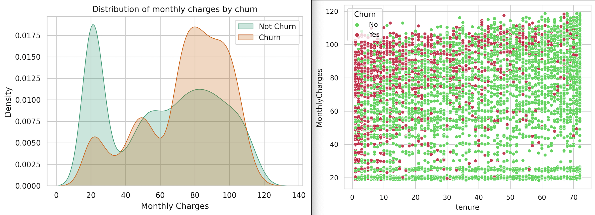

# Customer Retention: Machine Learning and Data Analysis

Customer churn is a common problem for subscription-based businesses, including telecommunications companies. Predicting which customers are likely to leave can help businesses take steps to improve retention and reduce revenue loss.

This project focuses on analyzing a dataset of customer information to achieve two main objectives:
- **Predicting Churn:** Build machine learning models (e.g., Logistic Regression, Random Forest, XGBoost) to identify customers at risk of churning.
- **Understanding Key Drivers:** Examine the relationships between customer attributes and churn to identify the factors that most influence customer behavior.

The project will use these findings to provide recommendations for reducing churn and improving customer retention strategies.

## Executive Summary

### Overview of Findings
Churn is highest among **senior citizens** (proportionally), **single customers without dependents** (~35%), and customers on **month-to-month contracts.** Bundled services, particularly entertainment options, and automatic payment methods **significantly reduce churn,** while fiber optic internet users show elevated churn rates requiring investigation. Customers paying via electronic check have the highest churn, and churn is most likely within the first year of tenure, especially for customers in the $70+ monthly charge range. Addressing these specific segments and optimizing service offerings and payment options can directly improve retention.

## Insights Deep Dive

### **Customer Demographics**
* ****Family Status Strongly Influences Retention.**** Customers with partners show a dramatic 15% lower churn rate (20% vs 35%) compared to single customers. This pattern is further reinforced when dependents are present, with similar retention improvements (20% vs 35% churn rate), suggesting family-oriented customers are significantly more stable.
* **Senior Citizens Present a Critical Retention Challenge.** Despite being a smaller segment of the customer base, senior citizens demonstrate notably higher churn rates proportionally, indicating a potential gap in services or support tailored to this demographic.
* ****Gender Has No Significant Impact.**** The data shows nearly identical churn patterns across gender categories, with balanced distribution in both churned and retained customers, suggesting gender-specific retention strategies are unnecessary.

  

### **Services and Support**
* ****Technical Support is a Key Retention Driver.**** Customers with tech support show significantly lower churn rates, particularly when combined with other services, indicating its role as a crucial touchpoint for customer satisfaction and loyalty.
* **Fiber Optic Service Shows Concerning Patterns.** Despite being a premium offering, fiber optic internet service exhibits higher churn rates than other internet service types, suggesting potential service quality or pricing issues that need investigation.
* ****Service Bundling Impacts Retention.**** Customers with multiple services, especially those including entertainment options (StreamingTV, StreamingMovies), demonstrate lower churn rates, indicating the effectiveness of service bundling as a retention strategy.

### **Pricing and Payment**
* ****Contract Length is the Strongest Predictor.**** Month-to-month contracts show significantly higher churn rates compared to one-year or two-year contracts, with two-year contracts having the lowest churn rate, demonstrating the importance of longer-term commitments.
* **Price Sensitivity Threshold at $70.** The density plot reveals a clear threshold around $70 monthly charges where churn risk increases substantially, with customers paying higher amounts showing a pronounced peak in churn rates.
* ****Payment Method Influences Churn.**** Electronic check payments correlate with notably higher churn rates compared to other payment methods, particularly automatic payment options, suggesting a link between payment convenience and customer retention.
* **Early Tenure is Critical.** Most customer churn occurs early in the relationship, typically within the first year, indicating the importance of early engagement and satisfaction in establishing long-term customer relationships.

  

## Model results

I've selected these 3 classifier models for churn prediction due to their ability to handle complex, non-linear relationships and capture patterns in data.

These are the benchmark results of the models:

**Cross Validation Score:** This is the average performance metric (e.g., accuracy, precision, recall) of a model across multiple subsets (folds) of the dataset.

**ROC_AUC Score:** ROC) curve plots the true positive rate (TPR) against the false positive rate (FPR) at various thresholds, and the (AUC) quantifies how well the model distinguishes between classes. A higher AUC (closer to 1) indicates better model performance, particularly for imbalanced datasets like churn prediction.

| Model | Cross Validation | ROC_AUC Score |
|----------|----------|----------|
| XGB Classifier | 93.44% | 84.31%   |
| DecisionTreeClassifier | 86.57%   | 79.14% |
| RandomForestClassifier | 89.28%  | 80.43% |

The scores indicate strong performance for all models, but XGB Classifier stands out as the best performing model, with high cross-validation and ROC_AUC scores, making it the most reliable and effective model for churn prediction.

**Confusion Matrix and AUC Curve:**

  
  
The confusion matrix shows  that the XGBClassifier correctly identifies about 42.93% of churning customers and 41.38% of staying customers, with misclassifications remaining low at approximately 8% for both false positives and false negatives. The ROC curve, with its Area Under Curve (AUC) of 0.93 and steep initial ascent, demonstrates the model's strong ability to distinguish between churning and non-churning customers across different classification thresholds, where a score of 1.0 represents perfect prediction.

### Model Performance

**XGBClassifier** shows the best overall performance with **93.30% cross-validation** score and **0.93 ROC-AUC**, compared to *89.32% cross-validation* and *0.88 ROC-AUC* for *RandomForestClassifier* and *86.77% cross-validation score* and *0.77 ROC-AUC* for *DecisionTreeClassifier* respecitvely.

XGBClassifier has shown:
* Strong overall accuracy of 85% with balanced performance across classes
* Low false positive rate (7.84%) and false negative rate (7.65%), indicating good reliability
* Confusion matrix with good balance in predictions

## Reccomendations

- **Launch "First Year Success" program offering 20% discount on 2-year contracts for new customers.** Add mandatory support check-ins during first 6 months to catch issues early. Currently 45% of customers churn in year one and 65% remain on month-to-month contracts.
- **Convert electronic check customers to automatic payments by offering $5 monthly discount.** Target highest-risk segments first based on tenure and service package. Data shows electronic check users have 40% higher churn than other payment methods.
- **Develop dedicated "Senior Care" package with priority tech support line and streamlined billing portal.** Include age-specific benefits for 2-year commitments. This addresses the double churn rate among senior citizens compared to other demographics.
- **Restructure service packages to maintain core offerings under $70 threshold.** Add premium features like tech support and streaming only to higher-tier packages to justify pricing. Analysis reveals sharp retention decline when monthly charges exceed $70.
- **Make basic tech support standard in all service packages.** Create tiered premium support options for advanced services with focus on proactive monitoring. Tech support subscribers demonstrate 30% better retention rates than non-subscribers.
